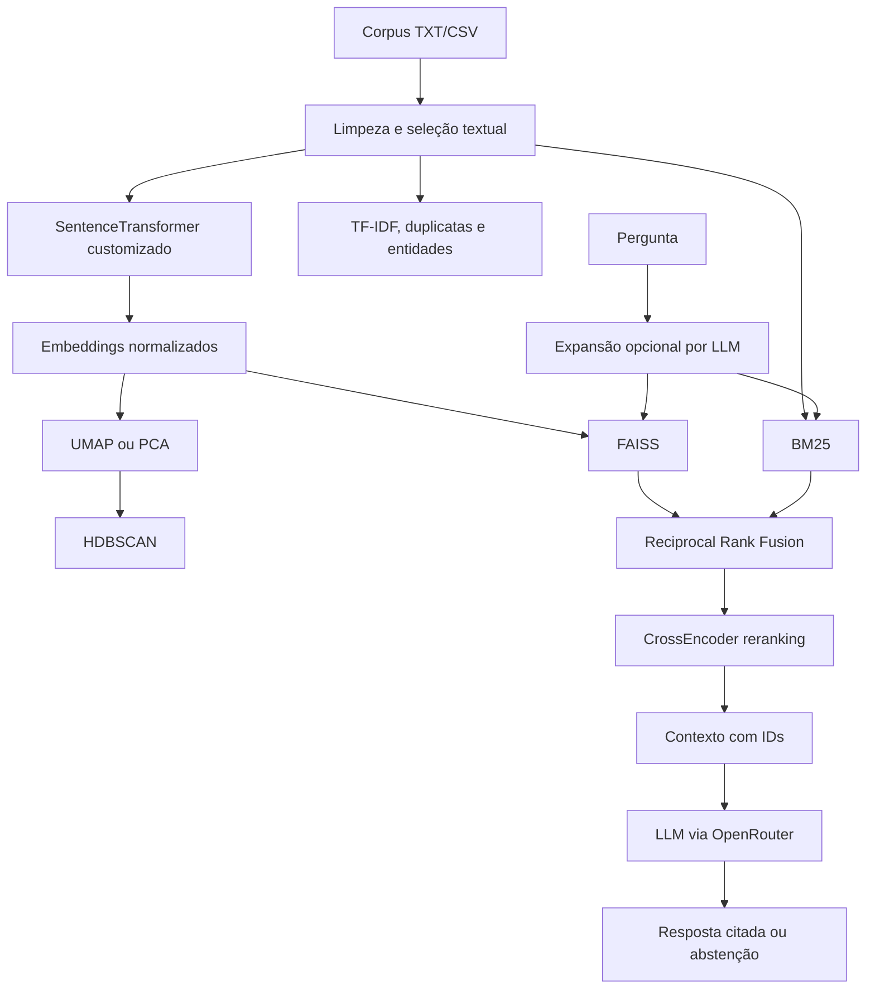

# AetherMap 🧭

**Plataforma de cartografia semântica 3D e RAG híbrido com respostas citadas e avaliação reproduzível.**

[](https://www.python.org/)
[](https://fastapi.tiangolo.com/)
[](https://www.apache.org/licenses/LICENSE-2.0)
[](https://huggingface.co/spaces/Madras1/AetherMap)

🌐 [Interface web](https://aethermap.onrender.com/) · 📡 [API e documentação interativa](https://madras1-aethermap.hf.space/docs) · 🤖 [Embedding próprio](https://huggingface.co/Madras1/minilm-gooaq-mnr-v5) · 💻 [Código do backend](https://huggingface.co/spaces/Madras1/AetherMap/tree/main)

## Visão geral

O AetherMap transforma corpus em arquivos TXT ou CSV em um espaço semântico
explorável. A plataforma gera embeddings, projeta os documentos em um mapa 3D,
descobre clusters por densidade, identifica duplicatas e entidades e permite
consultar o corpus por meio de um pipeline de Retrieval-Augmented Generation.

O projeto foi construído com dois objetivos complementares:

1. **Cartografia semântica:** tornar grandes coleções de textos visualmente
   navegáveis, sem exigir rotulagem manual prévia.
2. **RAG verificável:** produzir respostas fundamentadas nos documentos
   recuperados, com citações no formato `[ID: n]` e política de abstenção quando
   o contexto não sustenta uma resposta.

Este repositório contém a **interface web** do projeto. O backend FastAPI, os
modelos e a implantação da API ficam no [Hugging Face Space](https://huggingface.co/spaces/Madras1/AetherMap).

## Destaques técnicos

- RAG híbrido combinando **FAISS**, **BM25**, **Reciprocal Rank Fusion** e
  **CrossEncoder reranking**.
- Embedding próprio, `Madras1/minilm-gooaq-mnr-v5`, fine-tunado com Multiple
  Negatives Ranking sobre GooAQ.
- Cinco modos de ablação expostos pela API para medir o efeito de cada componente.
- Projeção tridimensional com UMAP ou PCA e clusterização por HDBSCAN.
- Grafo de documentos e entidades com extração NER em português e inglês.
- Detecção de duplicatas exatas e semânticas, TF-IDF, riqueza lexical e entropia.
- Respostas LLM via OpenRouter com citações, controle de abstenção e busca web
  opcional via Tavily.
- Observabilidade com métricas Prometheus e tempos de execução por etapa da busca.
- Suíte experimental com benchmarks end-to-end, ablação, LLM-as-judge,
  intervalos de confiança e profiling de latência.

## Demonstração


## Arquitetura



### Fluxo de ingestão

```text
TXT/CSV
  -> seleção e limpeza dos textos
  -> embeddings SentenceTransformer
  -> normalização vetorial
  -> índices FAISS e BM25
  -> UMAP ou PCA para projeção 3D
  -> HDBSCAN para clusters
  -> TF-IDF, duplicatas, métricas e entidades
  -> cache em memória por job_id
```

### Fluxo de consulta

```text
Pergunta + job_id
  -> expansão opcional da query
  -> recuperação semântica FAISS
  -> recuperação lexical BM25
  -> fusão RRF
  -> reranking com CrossEncoder
  -> montagem do contexto com [ID: n]
  -> resposta via OpenRouter com citações
```

## Modos de ablação

| Modo | Componentes ativos |
| --- | --- |
| `faiss_only` | Busca semântica FAISS |
| `bm25_only` | Busca lexical BM25 |
| `hybrid` | FAISS + BM25 + RRF |
| `hybrid_rerank` | FAISS + BM25 + RRF + CrossEncoder |
| `full` | Pipeline híbrido, reranking e expansão de query por LLM |

Esses modos permitem avaliar se o custo de cada componente é acompanhado por
ganho mensurável de recuperação ou de qualidade da resposta.

## Tecnologias

| Camada | Implementação |
| --- | --- |
| API | FastAPI + Uvicorn |
| Embeddings | `Madras1/minilm-gooaq-mnr-v5` com SentenceTransformers |
| Recuperação vetorial | FAISS `IndexFlatIP` ou `IndexHNSWFlat` |
| Recuperação lexical | BM25 customizado |
| Fusão de rankings | Reciprocal Rank Fusion |
| Reranking | `cross-encoder/mmarco-mMiniLMv2-L12-H384-v1` |
| Redução dimensional | UMAP ou PCA |
| Clusterização | HDBSCAN |
| NLP e entidades | spaCy, NLTK e langdetect |
| Geração | OpenRouter, com modelo configurável |
| Busca web | Tavily |
| Observabilidade | Prometheus FastAPI Instrumentator + prometheus-client |
| Frontend | HTML, CSS, JavaScript, Bootstrap, Three.js, Plotly e Chart.js |

## Funcionalidades da interface

- upload de `.txt` e `.csv`, com seleção da coluna textual;
- parâmetros ajustáveis de clusterização e modo rápido com PCA;
- mapa semântico 3D navegável com detalhes dos documentos;
- visualizações de documentos e da rede de entidades;
- busca RAG com destaque dos resultados no mapa;
- nomes e resumos dos clusters gerados por LLM;
- análise narrativa do grafo de entidades;
- gráficos globais de TF-IDF e distribuição dos clusters;
- identificação de documentos duplicados;
- busca web opcional e temas claro/escuro.

## Endpoints principais

| Endpoint | Função |
| --- | --- |
| `GET /` | Verificação de integridade da API |
| `GET /metrics` | Métricas Prometheus |
| `POST /csv_columns/` | Lista as colunas de um CSV |
| `POST /process/` | Processa o corpus e constrói os artefatos de busca e análise |
| `POST /search/` | Executa o pipeline de RAG sobre um `job_id` |
| `POST /describe_clusters/` | Nomeia e resume clusters por LLM |
| `POST /search_web/` | Transforma resultados da Tavily em corpus semântico |
| `POST /entity_graph/` | Extrai entidades e constrói o grafo |
| `POST /analyze_graph/` | Produz uma análise narrativa do grafo |

## Avaliação experimental

O AetherMap separa a avaliação em recuperação, geração, citação, abstenção e
latência. Isso evita concluir que o sistema é bom apenas porque produz uma
resposta plausível.

As medições incluem:

- `Hit@k` e Mean Reciprocal Rank para recuperação;
- validação das citações e do documento-fonte;
- exact-match literal e qualidade semântica da resposta;
- correção, fidelidade e qualidade de citação por LLM-as-judge;
- controles sem resposta construídos sem o documento-fonte e com verificação de
  vazamento temático;
- latência ponta a ponta e profiling das etapas internas;
- comparação A/B do embedding customizado contra um baseline.

### Snapshot SQuAD-PT — 11 de maio de 2026

O benchmark principal enviou `120` contextos à API e executou `40` perguntas com
resposta mais `10` controles sem resposta em cada modo, totalizando `250`
consultas. Os números abaixo são um snapshot histórico do ambiente público, não
uma garantia de desempenho universal.

| Modo | Hit@1 | Hit@3 | MRR | Citação no documento correto | Precisão de recusa | Latência média |
| --- | ---: | ---: | ---: | ---: | ---: | ---: |
| `faiss_only` | 0,57 | 0,80 | 0,69 | 0,88 | 1,00 | 9,31 s |
| `bm25_only` | 0,80 | 0,82 | 0,83 | 0,93 | 1,00 | 10,30 s |
| `hybrid` | 0,72 | 0,90 | 0,82 | 0,88 | 1,00 | 8,11 s |
| `hybrid_rerank` | **0,97** | **1,00** | **0,99** | **0,97** | **1,00** | 22,34 s |
| `full` | **0,97** | **1,00** | **0,99** | **1,00** | **1,00** | 24,82 s |

No mesmo conjunto, o modo `hybrid_rerank` obteve qualidade semântica `0,98`,
fidelidade média `4,98/5` e taxa de aprovação `0,98` no juiz Mistral. O modo
`full` não apresentou ganho de recuperação suficiente para compensar a expansão
de query e a latência adicional.

O embedding customizado apresentou ganhos em alguns testes sem reranking, mas o
resultado variou por domínio. O projeto não afirma superioridade universal sobre
outros modelos; a contribuição é o fine-tuning acompanhado de avaliação A/B e
análise de regressão.

## Execução local

### Frontend

```bash
git clone https://github.com/MadrasLe/aethermap.git
cd aethermap
python -m http.server 5500
```

Abra `http://localhost:5500`. Por padrão, `script.js` aponta para a API publicada:

```javascript
const API_URL = "https://madras1-aethermap.hf.space";
```

### Backend

```bash
git clone https://huggingface.co/spaces/Madras1/AetherMap aethermap-backend
cd aethermap-backend
pip install -r requirements.txt
uvicorn app:app --host 0.0.0.0 --port 7860
```

Para geração de respostas, configure `OPENROUTER_API_KEY`. A busca web exige
`TAVILY_API_KEY`. Depois, altere `API_URL` no frontend para
`http://localhost:7860` e garanta que a política de CORS permita a origem usada.

## Organização pública do projeto

| Componente | Local |
| --- | --- |
| Frontend estático | [GitHub — MadrasLe/aethermap](https://github.com/MadrasLe/aethermap) |
| Backend, Docker e implantação | [Hugging Face Space — Madras1/AetherMap](https://huggingface.co/spaces/Madras1/AetherMap/tree/main) |
| Modelo de embeddings | [Hugging Face — Madras1/minilm-gooaq-mnr-v5](https://huggingface.co/Madras1/minilm-gooaq-mnr-v5) |
| API interativa | [madras1-aethermap.hf.space/docs](https://madras1-aethermap.hf.space/docs) |

## Limitações atuais

- Os jobs, embeddings e índices vivem em memória e desaparecem quando o backend
  reinicia.
- O processamento e o CrossEncoder são CPU-bound na implantação gratuita.
- A URL da API ainda é fixa no JavaScript do frontend.
- A interface depende de bibliotecas carregadas por CDN.
- OpenRouter e Tavily introduzem dependência de serviços externos.
- Para produção em maior escala, os próximos passos são persistência dos índices,
  armazenamento externo de jobs, paginação de `plot_data` e otimização do reranker.

## Licença

Apache-2.0

Desenvolvido por **Gabriel Yogi**.
